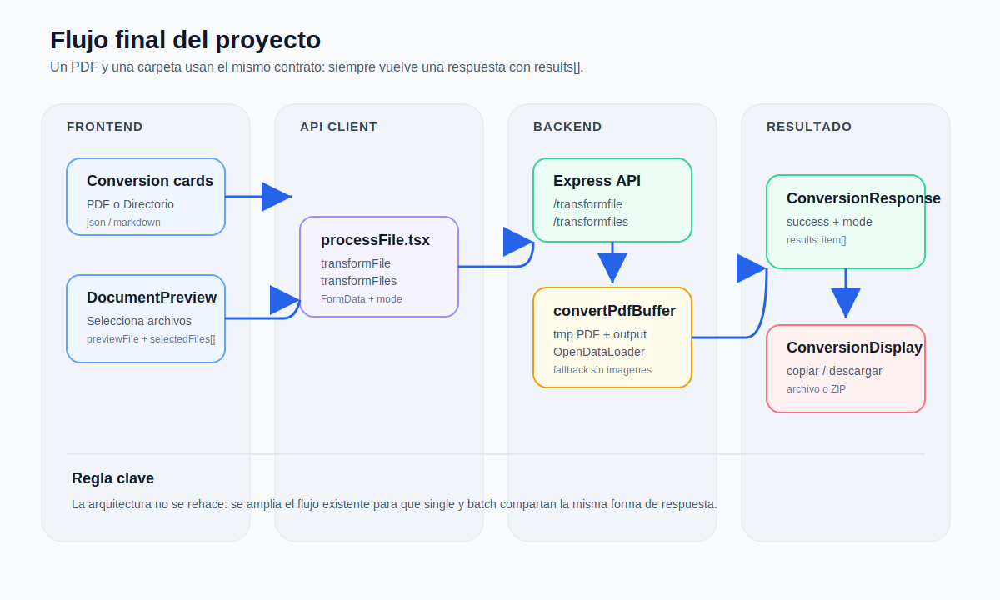
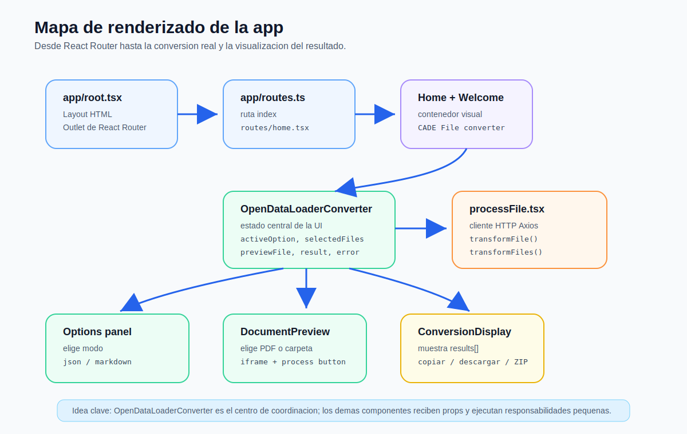
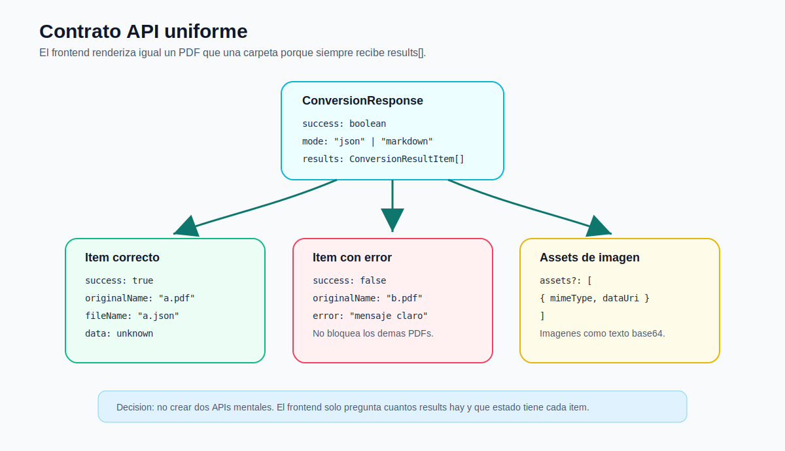
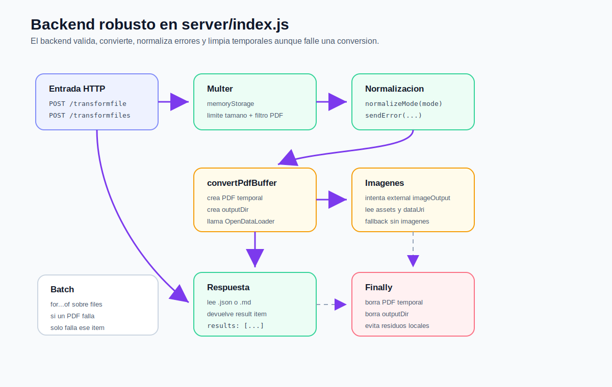
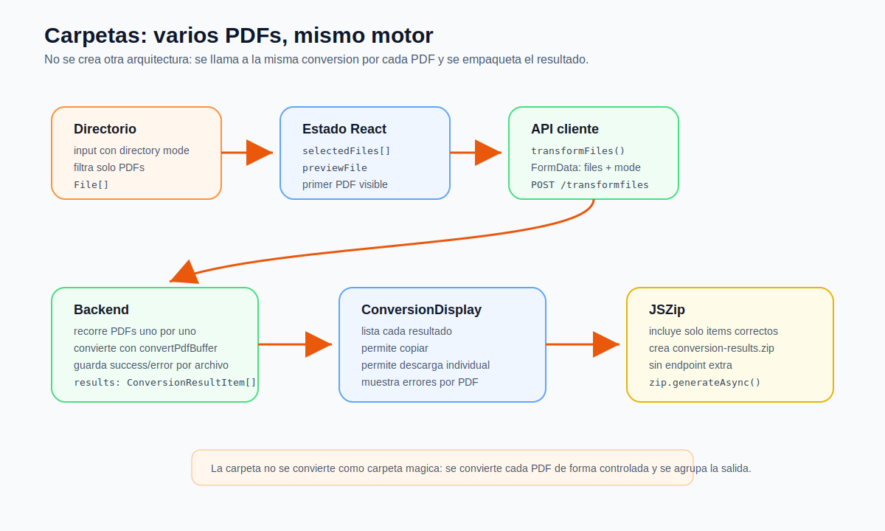
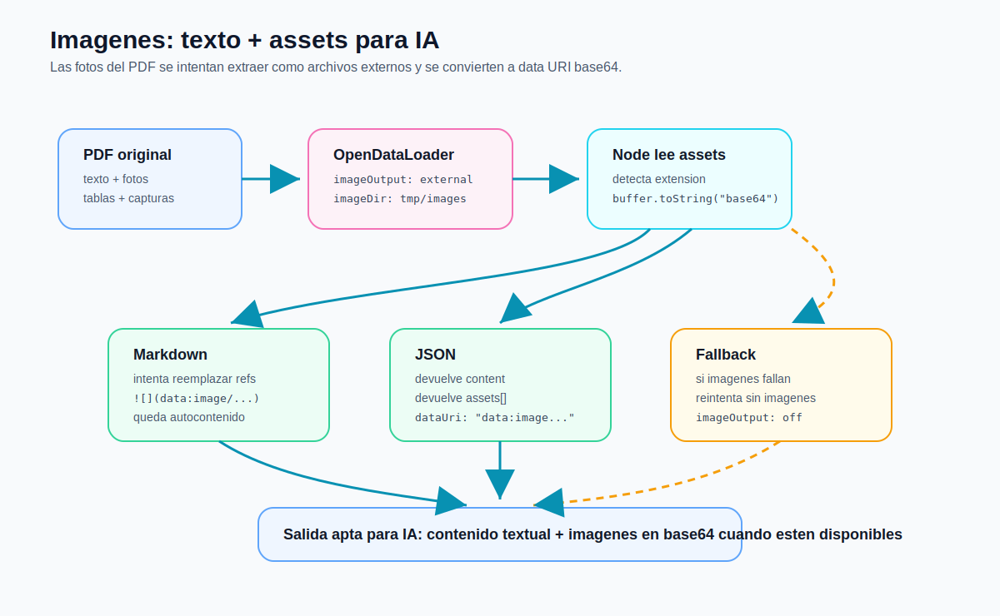
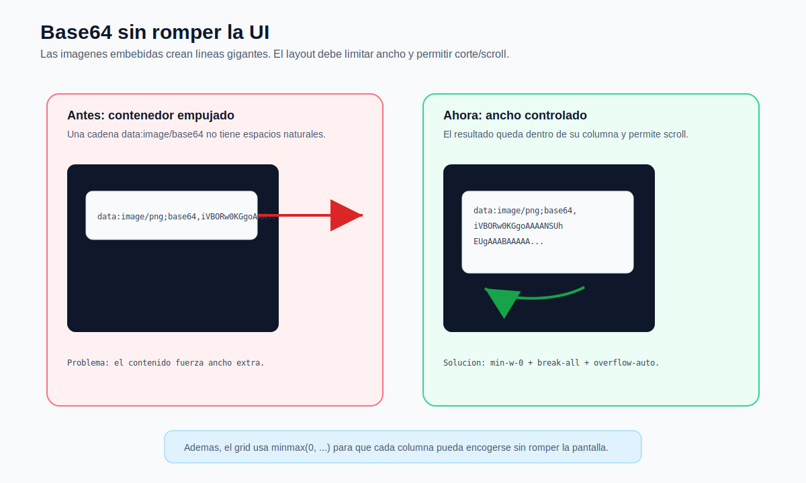

# Manual completo de funcionamiento e implementacion del conversor PDF

Este documento explica el funcionamiento entero de la aplicacion, no solo los cambios nuevos. La idea es que puedas abrir este manual y entender:

- Como se renderiza la app.
- Que hace cada archivo importante.
- Donde se selecciona el PDF o la carpeta.
- Donde se llama a la API.
- Donde se convierte realmente el PDF.
- Como responde el backend.
- Como se pintan los resultados.
- Como funciona la descarga individual y ZIP.
- Como se intentan conservar imagenes del PDF.
- Que se anadio para completar el proyecto sin romper la estructura existente.

El objetivo principal fue respetar la arquitectura actual del proyecto. No se rehizo la app desde cero; se amplio el flujo que ya existia.

## 1. Vision general

La aplicacion es un conversor de PDFs construido con:

- React Router para el frontend.
- TypeScript en la parte de React.
- Tailwind CSS para estilos.
- Axios para llamar al backend.
- Express para la API local.
- Multer 2.1.1 para recibir archivos.
- `@opendataloader/pdf` para convertir PDFs.
- Java como dependencia necesaria de `@opendataloader/pdf`.
- JSZip para descargar resultados multiples comprimidos.

La app permite cuatro modos:

- PDF a JSON.
- PDF a Markdown.
- Directorio a JSON.
- Directorio a Markdown.

La decision tecnica mas importante fue unificar la respuesta:

```txt
1 PDF       -> results con 1 elemento
varios PDF  -> results con varios elementos
```

Asi el frontend no necesita dos formas distintas de pintar resultados.



## 2. Estructura del proyecto

La estructura importante queda asi:

```txt
app/
  api/
    processFile.tsx
  features/
    conversion/
      ConversionOptionCard.tsx
      ConversionOptionsPanel.tsx
      OpenDataLoaderConverter-v2.tsx
      conversionTypes.ts
    conversionDisplay/
      conversionDisplay.tsx
    documentPreview/
      DocumentPreview.tsx
  pages/
    welcome/
      welcome.tsx
  routes/
    home.tsx
  root.tsx
  routes.ts
  app.css

server/
  index.js

docs/
  final-implementation-manual.md
  assets/
    diagrams/
      final-app-map.svg
      final-overview.svg
      final-api-contract.svg
      final-backend-flow.svg
      final-folder-zip.svg
      final-image-assets.svg
      final-layout-safety.svg
```

La separacion principal es:

- `app`: interfaz, estado, llamada HTTP y renderizado.
- `server`: conversion real del PDF.
- `docs`: manuales y diagramas.

## 3. Mapa de renderizado de la app

El frontend entra por React Router. El flujo real de renderizado es:

```txt
app/root.tsx
  -> <Outlet />
app/routes.ts
  -> routes/home.tsx
routes/home.tsx
  -> <Welcome />
pages/welcome/welcome.tsx
  -> <OpenDataLoaderConverter />
features/conversion/OpenDataLoaderConverter-v2.tsx
  -> opciones + visor + resultados
```



### `app/root.tsx`

Este archivo define el layout HTML general:

- `<html lang="es">`
- `<head>`
- fuentes
- `<body>`
- `<Outlet />`
- scripts de React Router
- boundary de errores

La parte clave es:

```tsx
export default function App() {
  return <Outlet />;
}
```

`Outlet` es el hueco donde React Router renderiza la pagina activa.

### `app/routes.ts`

Define la ruta principal:

```ts
export default [index("routes/home.tsx")] satisfies RouteConfig;
```

Eso significa que la primera pantalla de la app es `app/routes/home.tsx`.

### `app/routes/home.tsx`

Carga la pagina `Welcome`:

```tsx
export default function Home() {
  return <Welcome />;
}
```

Tambien define la metadata principal de la app:

```ts
{ title: "CADE File converter" }
{ name: "description", content: "Convierte PDFs a JSON o Markdown con vista previa y descarga de resultados." }
```

### `app/pages/welcome/welcome.tsx`

Es el contenedor visual de la pagina. Muestra el titulo:

```txt
CADE File converter
```

Y renderiza el componente principal:

```tsx
<OpenDataLoaderConverter />
```

## 4. Centro real del frontend

El archivo central del frontend es:

```txt
app/features/conversion/OpenDataLoaderConverter-v2.tsx
```

Este componente coordina todo:

- Las opciones disponibles.
- La opcion activa.
- Los PDFs seleccionados.
- El PDF que se previsualiza.
- La URL temporal del PDF para el iframe.
- El resultado de la conversion.
- Los errores.
- El estado de carga.

Sus estados principales son:

```ts
const [activeOption, setActiveOption] = useState<ConversionOption | null>(null);
const [selectedFiles, setSelectedFiles] = useState<File[]>([]);
const [previewFile, setPreviewFile] = useState<File | null>(null);
const [fileUrl, setFileUrl] = useState<string | null>(null);
const [result, setResult] = useState<ConversionResponse | null>(null);
const [error, setError] = useState<string | null>(null);
const [isLoading, setIsLoading] = useState(false);
```

### Por que este componente es el centro

Porque decide:

- Si se procesa un unico PDF.
- Si se procesa una carpeta o varios PDFs.
- Que modo se manda al backend.
- Que componente recibe que datos.
- Cuando se limpia el resultado anterior.
- Cuando se muestra el loading.

La decision principal esta aqui:

```ts
const response = activeOption.directory
  ? await transformFiles(selectedFiles, activeOption.mode)
  : await transformFile(selectedFiles[0], activeOption.mode);
```

Esto significa:

- Si `directory` es `false`, se llama a `/api/transformfile`.
- Si `directory` es `true`, se llama a `/api/transformfiles`.

## 5. Opciones de conversion

Las opciones estan definidas en `OpenDataLoaderConverter-v2.tsx`:

```ts
const conversionOptions: ConversionOption[] = [
  {
    id: "pdf-json",
    title: "PDF a JSON",
    directory: false,
    mode: "json",
  },
  {
    id: "pdf-markdown",
    title: "PDF a Markdown",
    directory: false,
    mode: "markdown",
  },
  {
    id: "dir-json",
    title: "Directorio a JSON",
    directory: true,
    mode: "json",
  },
  {
    id: "dir-markdown",
    title: "Directorio a Markdown",
    directory: true,
    mode: "markdown",
  },
];
```

Cada opcion controla dos cosas:

- `directory`: si acepta uno o varios archivos.
- `mode`: si convierte a `json` o `markdown`.

## 6. Componentes de opciones

### `ConversionOptionsPanel.tsx`

Renderiza la lista de opciones:

```tsx
{options.map((option) => (
  <ConversionOptionCard
    key={option.id}
    option={option}
    selected={activeOption?.id === option.id}
    onSelect={onOptionSelect}
  />
))}
```

Este componente no hace conversion. Solo pinta tarjetas.

### `ConversionOptionCard.tsx`

Representa una tarjeta individual.

Responsabilidades:

- Mostrar icono.
- Mostrar titulo.
- Mostrar descripcion.
- Notificar que el usuario ha seleccionado esa opcion.

La seleccion se comunica hacia arriba:

```ts
function handleClick() {
  onSelect(option);
}
```

El estado real queda en `OpenDataLoaderConverter-v2.tsx`.

## 7. Seleccion y preview de documentos

El archivo responsable es:

```txt
app/features/documentPreview/DocumentPreview.tsx
```

Este componente no convierte el PDF. Solo se encarga de:

- Abrir el selector de archivo.
- Permitir PDF individual o carpeta.
- Mostrar el nombre del PDF.
- Mostrar cuantos PDFs hay en modo carpeta.
- Mostrar el PDF en un `iframe`.
- Lanzar el boton de procesar.

### Modo individual

Cuando la opcion activa es PDF a JSON o PDF a Markdown:

```tsx
multiple={false}
```

La app se queda con un solo PDF.

### Modo directorio

Cuando la opcion activa es Directorio a JSON o Directorio a Markdown:

```tsx
multiple={directoryMode}
```

Y se pasan atributos compatibles con seleccion de carpetas:

```tsx
const directoryInputProps = directoryMode
  ? { webkitdirectory: "", directory: "" }
  : {};
```

Esto permite que el navegador entregue muchos archivos desde una carpeta.

### Filtro de PDFs

El filtro real se hace en `OpenDataLoaderConverter-v2.tsx`:

```ts
const pdfFiles = files.filter((file) =>
  file.type === "application/pdf" ||
  file.name.toLowerCase().endsWith(".pdf")
);
```

Esto evita procesar archivos que no sean PDF.

### Preview

Aunque haya una carpeta completa, el visor muestra un unico PDF:

```ts
previewFile
```

Normalmente es el primer PDF seleccionado. Esto mantiene la UI simple.

## 8. Tipos compartidos del flujo

Archivo:

```txt
app/features/conversion/conversionTypes.ts
```

Este archivo define el contrato mental entre frontend y backend.



### `ConversionOptionMode`

```ts
export type ConversionOptionMode = "json" | "markdown";
```

Sirve para limitar los modos validos. No se puede mandar cualquier string.

### `ConversionOption`

```ts
export interface ConversionOption {
  id: "pdf-json" | "pdf-markdown" | "dir-json" | "dir-markdown";
  title: string;
  description: string;
  icon: string;
  directory: boolean;
  mode: ConversionOptionMode;
}
```

Representa cada tarjeta de conversion.

Campos importantes:

- `id`: identifica la tarjeta.
- `directory`: indica si la opcion trabaja con una carpeta o varios PDFs.
- `mode`: indica el formato de salida.

### `ConversionImageAsset`

```ts
export interface ConversionImageAsset {
  fileName: string;
  path: string;
  mimeType: string;
  dataUri: string;
}
```

Representa una imagen extraida del PDF.

Ejemplo:

```json
{
  "fileName": "image-1.png",
  "path": "images/image-1.png",
  "mimeType": "image/png",
  "dataUri": "data:image/png;base64,..."
}
```

Esto permite que una IA reciba la imagen como texto base64, siempre que la libreria haya podido extraerla.

### `ConversionResultItem`

```ts
export interface ConversionResultItem {
  success: boolean;
  originalName: string;
  fileName?: string;
  data?: unknown;
  assets?: ConversionImageAsset[];
  error?: string;
}
```

Representa el resultado de un PDF concreto.

Por que existe:

- En una carpeta, cada PDF puede salir bien o mal.
- No conviene perder toda la conversion si solo falla un archivo.
- Cada item puede tener su propio error.

### `ConversionResponse`

```ts
export interface ConversionResponse {
  success: boolean;
  mode: ConversionOptionMode;
  results: ConversionResultItem[];
  error?: string;
}
```

Representa la respuesta completa de la API.

Por que se diseno asi:

- Un PDF individual devuelve `results` con 1 item.
- Una carpeta devuelve `results` con varios items.
- `ConversionDisplay` puede renderizar ambos casos igual.

## 9. Cliente API del frontend

Archivo:

```txt
app/api/processFile.tsx
```

Este archivo es el puente entre React y Express.

Importante: aqui no se convierte el PDF. Aqui solo se manda el archivo al backend.

### URL de API

```ts
const API_URL = import.meta.env.VITE_API_URL ?? 'http://localhost:3001/api';
```

Por que se hace asi:

- En desarrollo usa `http://localhost:3001/api`.
- En otro entorno se puede cambiar con `VITE_API_URL`.
- No se obliga a tocar codigo para cambiar la URL.

### `transformFile`

```ts
export async function transformFile(
  file: File,
  mode: ConversionOptionMode
): Promise<ConversionResponse>
```

Hace esto:

```txt
File + mode
  -> FormData
  -> POST /api/transformfile
  -> ConversionResponse
```

El campo del archivo se llama:

```ts
formData.append("file", file);
```

Ese nombre debe coincidir con el backend:

```js
upload.single('file')
```

### `transformFiles`

```ts
export async function transformFiles(
  files: File[],
  mode: ConversionOptionMode
): Promise<ConversionResponse>
```

Hace esto:

```txt
File[] + mode
  -> FormData
  -> POST /api/transformfiles
  -> ConversionResponse
```

Cada archivo se manda con el nombre:

```ts
formData.append("files", file);
```

Ese nombre debe coincidir con el backend:

```js
upload.array('files', MAX_FILES)
```

### Manejo de errores

`getRequestError` intenta sacar el mensaje mas claro:

```ts
if (axios.isAxiosError(error)) {
  const responseError = error.response?.data as { error?: string } | undefined;
  return responseError?.error || error.message;
}
```

Esto ayuda a mostrar mensajes reales del backend, por ejemplo:

```txt
No hay un PDF cargado para procesar.
Solo se permiten archivos PDF.
'java' command not found.
```

## 10. Backend completo

Archivo:

```txt
server/index.js
```

Este es el archivo que convierte de verdad. El frontend no convierte PDFs por si mismo.



El diagrama refleja el flujo actual del backend, incluida la validacion estricta con `getValidMode(mode)`.

### Arranque del servidor

```js
const app = express();
const PORT = 3001;
const isDevelopment = process.env.NODE_ENV !== 'production';
```

Y al final:

```js
app.listen(PORT, () => {
  console.log(`Servidor activo en http://localhost:${PORT}`);
});
```

El backend queda disponible en:

```txt
http://localhost:3001
```

La API se consume con prefijo:

```txt
http://localhost:3001/api
```

### Middlewares

```js
app.use(cors());
app.use(express.json());
```

`cors` permite que el frontend pueda llamar al backend aunque esten en puertos distintos.

`express.json()` permite leer body JSON, aunque en este caso los archivos llegan con `multipart/form-data` mediante Multer.

### Multer

Multer esta actualizado a la version 2.1.1 y recibe archivos en memoria:

```js
storage: multer.memoryStorage()
```

Esto significa que el archivo llega como:

```js
file.buffer
```

No llega automaticamente guardado en disco. Despues `convertPdfBuffer` lo escribe como temporal.

### Limites

```js
const MAX_FILE_SIZE = 25 * 1024 * 1024;
const MAX_FILES = 20;
```

Por que existen:

- Evitan subir PDFs demasiado grandes.
- Evitan carpetas enormes sin control. El limite de 20 reduce el riesgo de sobrecarga accidental en una sola peticion.
- Protegen memoria y CPU.

### Filtro PDF

```js
const isPdf =
  file.mimetype === 'application/pdf' ||
  file.originalname.toLowerCase().endsWith('.pdf');
```

Si no es PDF:

```js
callback(new Error('Solo se permiten archivos PDF.'));
```

Esto protege el backend antes de intentar convertir.

## 11. Helpers del backend

### `getValidMode`

```js
function getValidMode(mode) {
  return mode === 'json' || mode === 'markdown' ? mode : null;
}
```

Valida que llegue un modo soportado.

Si el cliente manda algo distinto de `json` o `markdown`, el endpoint responde con HTTP 400 usando `sendError`.

### `safeParseJson`

```js
function safeParseJson(content) {
  try {
    return JSON.parse(content);
  } catch {
    return content;
  }
}
```

La libreria puede devolver texto que deberia ser JSON, pero si no parsea, no se rompe todo el endpoint. Se devuelve el contenido como string.

### `getErrorMessage`

```js
function getErrorMessage(error) {
  return error instanceof Error ? error.message : 'Error al procesar el archivo.';
}
```

Normaliza errores desconocidos.

### `sendError`

```js
function sendError(res, status, message) {
  return res.status(status).json({
    success: false,
    error: message,
  });
}
```

Hace que los errores de API tengan una forma estable.

### `getConvertFormat`

```js
function getConvertFormat(mode) {
  return mode === 'markdown' ? 'markdown-with-images' : 'json';
}
```

En Markdown se intenta usar formato con imagenes.

En JSON se usa formato `json`.

## 12. Conversion real de un PDF

La funcion principal del backend es:

```js
async function convertPdfBuffer(file, mode)
```

Esta funcion se reutiliza para:

- Un PDF individual.
- Cada PDF dentro de una carpeta.

Flujo interno:

```txt
1. Recibe file.buffer desde Multer.
2. Crea un nombre temporal unico.
3. Escribe el PDF en la carpeta temporal del sistema.
4. Crea carpeta temporal de salida.
5. Crea carpeta temporal de imagenes.
6. Ejecuta @opendataloader/pdf.
7. Lee el archivo generado.
8. Lee imagenes extraidas si existen.
9. Construye ConversionResultItem.
10. Borra temporales en finally.
```

### Temporales

El PDF se escribe aqui:

```js
tempFilePath = path.join(tmpdir(), `${tempName}.pdf`);
```

La salida se guarda aqui:

```js
tempOutputDirPath = path.join(tmpdir(), `${tempName}_out`);
```

Por que se hace:

- `@opendataloader/pdf` trabaja mejor con rutas de archivo.
- El archivo subido viene en memoria.
- Hace falta crear un archivo temporal para que la libreria lo procese.

### Limpieza

Siempre se limpia en `finally`:

```js
if (tempFilePath) await fs.unlink(tempFilePath).catch(() => {});
if (tempOutputDirPath) {
  await fs.rm(tempOutputDirPath, { recursive: true, force: true }).catch(() => {});
}
```

Por que es importante:

- No deja PDFs del usuario en disco.
- No llena la carpeta temporal.
- No acumula imagenes ni resultados antiguos.

## 13. Endpoints de la API

### `POST /api/transformfile`

Sirve para un unico PDF.

Backend:

```js
app.post('/api/transformfile', upload.single('file'), async (req, res) => {
```

Espera:

```txt
multipart/form-data
  file: PDF
  mode: "json" | "markdown"
```

Si `mode` no es `json` ni `markdown`, responde HTTP 400:

```json
{
  "success": false,
  "error": "Modo de conversión no válido. Usa \"json\" o \"markdown\"."
}
```

Devuelve:

```json
{
  "success": true,
  "mode": "markdown",
  "results": [
    {
      "success": true,
      "originalName": "documento.pdf",
      "fileName": "documento.md",
      "data": "# Documento"
    }
  ]
}
```

Aunque sea un solo PDF, devuelve `results`.

### `POST /api/transformfiles`

Sirve para varios PDFs o una carpeta.

Backend:

```js
app.post('/api/transformfiles', upload.array('files', MAX_FILES), async (req, res) => {
```

Espera:

```txt
multipart/form-data
  files: PDF[]
  mode: "json" | "markdown"
```

Si `mode` no es `json` ni `markdown`, responde HTTP 400 con el mismo contrato de error que el endpoint individual.

Devuelve:

```json
{
  "success": true,
  "mode": "json",
  "results": [
    {
      "success": true,
      "originalName": "a.pdf",
      "fileName": "a.json",
      "data": {}
    },
    {
      "success": false,
      "originalName": "b.pdf",
      "error": "No se pudo convertir el archivo."
    }
  ]
}
```

Decision importante:

- Si un PDF falla, no falla toda la carpeta.
- El error queda solo en ese item.
- Los otros PDFs pueden terminar correctamente.

## 14. Flujo de PDF individual

```txt
Usuario selecciona "PDF a JSON" o "PDF a Markdown"
  -> ConversionOptionCard avisa al panel
  -> OpenDataLoaderConverter guarda activeOption
  -> DocumentPreview permite seleccionar un PDF
  -> OpenDataLoaderConverter guarda selectedFiles[0]
  -> DocumentPreview muestra preview con iframe
  -> Usuario pulsa "Procesar documento"
  -> handleProcess llama transformFile
  -> processFile.tsx manda POST /api/transformfile
  -> server/index.js recibe upload.single("file")
  -> convertPdfBuffer convierte el PDF
  -> backend devuelve ConversionResponse con results[0]
  -> ConversionDisplay muestra el resultado
  -> Usuario copia o descarga el archivo
```

## 15. Flujo de carpeta o multiples PDFs

La conversion de carpeta no usa una funcion magica distinta. Usa la misma conversion por cada PDF.



```txt
Usuario selecciona "Directorio a JSON" o "Directorio a Markdown"
  -> activeOption.directory pasa a true
  -> DocumentPreview activa seleccion multiple/carpeta
  -> El navegador entrega File[]
  -> OpenDataLoaderConverter filtra solo PDFs
  -> selectedFiles guarda todos los PDFs validos
  -> previewFile queda como primer PDF
  -> Usuario pulsa "Procesar documentos"
  -> handleProcess llama transformFiles
  -> processFile.tsx manda POST /api/transformfiles
  -> server/index.js recibe upload.array("files")
  -> backend recorre los PDFs con for...of
  -> cada PDF llama convertPdfBuffer
  -> cada PDF devuelve success o error
  -> backend devuelve results[]
  -> ConversionDisplay renderiza todos
  -> Usuario descarga individual o ZIP
```

Por que se procesa uno por uno:

- Menor consumo de memoria.
- Menor riesgo de saturar CPU.
- Mas facil controlar errores por archivo.
- Mas facil depurar.

## 16. Manejo de imagenes dentro del PDF

Algunos PDFs tienen fotos, capturas, logos o imagenes dentro. Para una IA, no siempre basta con extraer texto.



### Estrategia aplicada

Primero se intenta convertir con imagenes externas:

```js
await convert([tempFilePath], {
  outputDir: tempOutputDirPath,
  format: getConvertFormat(mode),
  imageOutput: 'external',
  imageFormat: 'png',
  imageDir: tempImageDirPath,
});
```

Despues Node lee las imagenes generadas:

```js
const buffer = await fs.readFile(entryPath);
```

Y las convierte en texto base64:

```js
dataUri: `data:${mimeType};base64,${buffer.toString('base64')}`
```

### En Markdown

Se intenta reemplazar referencias de imagen por `dataUri`:

```md

```

Esto deja el Markdown mas autocontenido.

### En JSON

El JSON devuelve:

```js
{
  content: safeParseJson(finalContent),
  assets,
}
```

Asi una IA puede recibir:

- Texto estructurado.
- Lista de imagenes.
- Cada imagen como `dataUri`.

### Fallback

Si la conversion con imagenes falla, el backend reintenta sin imagenes:

```js
await convert([tempFilePath], {
  outputDir: tempOutputDirPath,
  format: mode,
  imageOutput: 'off',
});
```

Por que:

- Mejor devolver texto sin imagenes que un error 500.
- Algunos PDFs son incompatibles con extraccion de imagenes.
- El usuario puede seguir usando el contenido principal.

### Limite importante

Esto no es OCR.

Si el PDF es una foto escaneada sin texto real, extraer la imagen no significa leer el texto dentro de la imagen. Para eso haria falta OCR o una API de vision.

## 17. Renderizado de resultados

Archivo:

```txt
app/features/conversionDisplay/conversionDisplay.tsx
```

Este componente recibe:

```ts
result: ConversionResponse | null;
error: string | null;
isLoading: boolean;
```

### Que muestra

- Estado de carga.
- Error global.
- Lista de resultados.
- Errores por archivo.
- Preview de texto convertido.
- Boton copiar con feedback de exito/error.
- Boton descargar archivo.
- Boton descargar ZIP si hay varios resultados correctos.

### Obtencion del texto

```ts
function getOutputText(item: ConversionResultItem) {
  if (!item.data) return "";
  return typeof item.data === "object"
    ? JSON.stringify(item.data, null, 2)
    : String(item.data);
}
```

Por que:

- Markdown suele venir como string.
- JSON puede venir como objeto.
- Para pintarlo y descargarlo se necesita texto.

### Nombre de archivo

```ts
function getFallbackFileName(item: ConversionResultItem, index: number) {
  if (item.fileName) return item.fileName;

  const baseName = item.originalName.replace(/\.pdf$/i, "") || `resultado-${index + 1}`;
  return `${baseName}.md`;
}
```

Esto evita quedarse sin nombre si el backend no lo manda.

### Copiar al portapapeles

El boton `Copiar` comprueba que la Clipboard API exista y envuelve la operacion en `try/catch`:

```ts
if (typeof navigator === "undefined" || !navigator.clipboard?.writeText) {
  setClipboardStatus({
    key: resultKey,
    message: "No se pudo copiar al portapapeles.",
    type: "error",
  });
  return;
}
```

Si la copia funciona, muestra `Copiado al portapapeles.` junto al resultado copiado. Si falla, muestra `No se pudo copiar al portapapeles.`.

## 18. Logs internos del backend

Los logs informativos de conversion solo se muestran en desarrollo:

```js
if (isDevelopment) {
  console.log(`Operando en: ${tempFilePath}`);
  console.log(`Formato seleccionado: ${mode}`);
}
```

Y tambien:

```js
if (isDevelopment) {
  console.log('Archivos generados en salida:', filesInOutput);
}
```

En produccion, con `NODE_ENV=production`, no se imprimen rutas temporales ni detalles internos de salida. Los `console.error` de errores reales se mantienen.

## 19. Descarga individual y ZIP

### Descarga individual

Cada item correcto se descarga creando un `Blob`:

```ts
const blob = new Blob([outputText], { type: getMimeType(fileName) });
downloadBlob(blob, fileName);
```

### Descarga ZIP

Se usa `jszip`:

```ts
const zip = new JSZip();
successfulResults.forEach((item, index) => {
  zip.file(getFallbackFileName(item, index), getOutputText(item));
});

const zipBlob = await zip.generateAsync({ type: "blob" });
downloadBlob(zipBlob, `conversion-${result?.mode ?? "resultado"}.zip`);
```

Por que el ZIP se crea en frontend:

- Los resultados ya estan en memoria.
- No hace falta crear otro endpoint.
- No se crean ZIP temporales en el backend.
- Es suficiente para el tamano actual del proyecto.

Si en el futuro los resultados son gigantes, podria moverse el ZIP al backend.

## 20. Proteccion visual del layout

Las imagenes en base64 generan cadenas muy largas:

```txt
data:image/png;base64,iVBORw0KGgoAAAANSUhEUgAAAA...
```

Sin proteccion, esas cadenas empujan el contenedor hacia la derecha.



Se aplico:

```tsx
max-w-full overflow-auto whitespace-pre-wrap break-all
```

Y tambien:

```tsx
min-w-0
```

Ademas, el grid principal usa:

```tsx
grid-cols-[minmax(0,1.5fr)_minmax(0,1fr)]
```

Por que:

- `min-w-0` permite que los hijos se encojan.
- `minmax(0, ...)` evita que una columna fuerce ancho extra.
- `break-all` corta palabras/cadenas largas.
- `overflow-auto` permite scroll dentro del bloque.

## 21. Java y `@opendataloader/pdf`

`@opendataloader/pdf` ejecuta un proceso Java internamente.

Por eso pueden aparecer errores como:

```txt
'java' command not found
```

Significa que Java no esta en el `PATH` del terminal donde corre el backend.

Tambien puede aparecer:

```txt
UnsupportedClassVersionError
```

Significa que el Java activo es demasiado antiguo.

### Solucion permanente en Windows

Instalar Java moderno y anadir al `Path`:

```txt
C:\Program Files\Java\jdk-26.0.1\bin
```

Opcionalmente definir:

```txt
JAVA_HOME=C:\Program Files\Java\jdk-26.0.1
```

Comprobar:

```powershell
java -version
```

Importante:

- Cerrar VS Code.
- Abrir VS Code de nuevo.
- Abrir terminal nueva.
- Ejecutar otra vez el server.

## 22. Como ejecutar la app

Desde la carpeta del proyecto:

```txt
PDF_to_AI_format/PDF_to_AI_format
```

Instalar dependencias:

```bash
npm install
```

Para una instalacion limpia desde `package-lock.json`, especialmente en CI o VM, usar:

```bash
npm ci
```

Comprobar que las dependencias instaladas coinciden con `package.json`:

```bash
npm ls --depth=0
```

El estado esperado es que no aparezcan paquetes marcados como `extraneous`.

Levantar frontend:

```bash
npm run dev
```

Levantar backend:

```bash
npm run server
```

Comprobar Java:

```powershell
java -version
```

La app necesita:

- Frontend activo.
- Backend activo.
- Java disponible en el terminal del backend.

## 23. Variables de entorno

El frontend usa:

```ts
import.meta.env.VITE_API_URL
```

Si no existe, usa:

```txt
http://localhost:3001/api
```

Ejemplo de `.env`:

```env
VITE_API_URL=http://localhost:3001/api
```

La variable es util si:

- El backend cambia de puerto.
- El backend esta en otra maquina.
- Se despliega la app.

## 24. Contrato final de API

### Exito individual

```json
{
  "success": true,
  "mode": "markdown",
  "results": [
    {
      "success": true,
      "originalName": "documento.pdf",
      "fileName": "documento.md",
      "data": "# Documento"
    }
  ]
}
```

### Exito multiple con error parcial

```json
{
  "success": true,
  "mode": "json",
  "results": [
    {
      "success": true,
      "originalName": "a.pdf",
      "fileName": "a.json",
      "data": {
        "content": {},
        "assets": []
      }
    },
    {
      "success": false,
      "originalName": "b.pdf",
      "error": "La libreria no genero archivos. Revisa si el PDF tiene texto legible."
    }
  ]
}
```

### Error general

```json
{
  "success": false,
  "error": "No hay PDFs cargados para procesar."
}
```

## 25. Que existia antes y que se anadio

### Ya existia

- React Router.
- Pantalla principal.
- Tarjetas de conversion.
- Seleccion de PDF individual.
- Preview por `iframe`.
- Axios en `processFile.tsx`.
- Backend Express.
- Conversion con `@opendataloader/pdf`.
- Display basico de resultado.
- Copiar resultado.
- Descargar archivo individual.

### Se anadio o completo

- Contrato uniforme con `ConversionResponse`.
- `ConversionResultItem` para manejar resultado por PDF.
- `ConversionImageAsset` para imagenes base64.
- `selectedFiles` como array.
- `previewFile` separado del array completo.
- Seleccion multiple/carpeta.
- Endpoint `/api/transformfiles`.
- Reutilizacion de `convertPdfBuffer`.
- Procesamiento batch uno por uno.
- Errores por archivo.
- Descarga ZIP con `jszip`.
- URL de API configurable con `VITE_API_URL`.
- Validacion de PDFs en frontend y backend.
- Limite de tamano y cantidad de archivos.
- Multer actualizado a 2.1.1.
- Limite de carpeta ajustado a 20 PDFs por peticion.
- Validacion estricta de `mode` con HTTP 400 para valores no soportados.
- Feedback de exito/error al copiar resultados al portapapeles.
- Limpieza de temporales.
- Intento de extraccion de imagenes.
- Fallback si las imagenes fallan.
- Logs internos de conversion visibles solo en desarrollo.
- Metadata, idioma HTML y README actualizados para `CADE File converter`.
- Dependencias verificadas con `npm ls --depth=0` sin paquetes `extraneous`.
- Diagrama de backend actualizado para mostrar `getValidMode(mode)`.
- Proteccion visual para base64 largo.
- Manuales y diagramas SVG.

## 26. Guia mental rapida

Si quieres saber donde pasa cada cosa:

```txt
Render inicial:
  app/root.tsx
  app/routes.ts
  app/routes/home.tsx
  app/pages/welcome/welcome.tsx

Estado principal:
  app/features/conversion/OpenDataLoaderConverter-v2.tsx

Opciones:
  app/features/conversion/ConversionOptionsPanel.tsx
  app/features/conversion/ConversionOptionCard.tsx

Seleccion y preview:
  app/features/documentPreview/DocumentPreview.tsx

Tipos:
  app/features/conversion/conversionTypes.ts

Llamada HTTP:
  app/api/processFile.tsx

Conversion real:
  server/index.js

Resultados y descarga:
  app/features/conversionDisplay/conversionDisplay.tsx
```

## 27. Validaciones recomendadas

### Frontend

```bash
npm run typecheck
```

```bash
npm run build
```

### Backend

```bash
node --check server/index.js
```

### Manuales y SVG

Comprobar que los SVG existen:

```powershell
Get-ChildItem docs\assets\diagrams
```

Comprobar que el Markdown enlaza imagenes:

```powershell
rg "diagrams/.+[.]svg" docs\final-implementation-manual.md
```

## 28. Pruebas manuales importantes

### PDF individual a JSON

1. Seleccionar `PDF a JSON`.
2. Cargar un PDF con texto.
3. Procesar.
4. Ver resultado.
5. Descargar `.json`.

### PDF individual a Markdown

1. Seleccionar `PDF a Markdown`.
2. Cargar un PDF.
3. Procesar.
4. Ver Markdown.
5. Copiar al portapapeles.

### Carpeta a JSON

1. Seleccionar `Directorio a JSON`.
2. Cargar carpeta con varios PDFs.
3. Ver contador de PDFs.
4. Procesar.
5. Confirmar varios resultados.
6. Descargar ZIP.

### Carpeta a Markdown

1. Seleccionar `Directorio a Markdown`.
2. Cargar carpeta.
3. Procesar.
4. Confirmar que cada PDF genera `.md` o error individual.
5. Descargar ZIP.

### PDF con imagenes

1. Cargar PDF con imagenes.
2. Procesar en Markdown.
3. Revisar si aparecen `data:image/...`.
4. Procesar en JSON.
5. Revisar `assets`.
6. Confirmar que el layout no se rompe hacia la derecha.

### Error de Java

1. Ejecutar `java -version`.
2. Si falla, revisar `PATH`.
3. Reiniciar VS Code.
4. Levantar otra vez `npm run server`.

## 29. Errores comunes

### `Network Error`

Causa probable:

- El backend no esta activo.
- El frontend intenta llamar a `localhost:3001` y no hay servidor.

Solucion:

```bash
npm run server
```

### `POST /api/transformfile 500`

Causas posibles:

- Java no esta en PATH.
- Java es demasiado antiguo.
- PDF incompatible.
- La libreria no genero salida.

Solucion:

- Revisar consola del backend.
- Ejecutar `java -version`.
- Probar con otro PDF.

### El contenedor se va hacia la derecha

Causa:

- Resultado con base64 muy largo.

Solucion aplicada:

- `min-w-0`
- `minmax(0, ...)`
- `break-all`
- `overflow-auto`

### La carpeta no selecciona archivos

Causa posible:

- El navegador no soporta igual `webkitdirectory`.

Alternativa:

- Seleccionar multiples PDFs directamente si el navegador lo permite.

## 30. Mejoras futuras

### OCR real

Para PDFs escaneados, hace falta OCR. La extraccion de imagenes no lee texto dentro de una foto.

Opciones futuras:

- OCR local.
- API de vision.
- Pipeline que genere descripcion de imagenes.

### Preview Markdown

Ahora se muestra texto crudo. Se podria anadir:

- Vista raw.
- Vista renderizada.
- Toggle entre ambas.

### Selector de preview en carpeta

Ahora se previsualiza el primer PDF. Se podria anadir una lista lateral para elegir que PDF mirar.

### ZIP en backend

Ahora el ZIP se crea en frontend. Si los resultados crecen mucho, podria interesar generarlo en backend.

### Configuracion avanzada

Podrian anadirse opciones:

- Extraer imagenes: si/no.
- OCR: si/no.
- Formato de imagen.
- Limite de paginas.
- Procesamiento paralelo controlado.

## 31. Resumen final

La aplicacion completa funciona asi:

```txt
React Router renderiza la pagina
  -> Welcome muestra el conversor
  -> OpenDataLoaderConverter coordina estado
  -> DocumentPreview selecciona PDF o carpeta
  -> processFile.tsx llama a Express
  -> server/index.js valida y convierte
  -> @opendataloader/pdf genera JSON o Markdown
  -> Node recoge texto e imagenes
  -> backend devuelve ConversionResponse
  -> ConversionDisplay pinta results[]
  -> usuario copia, descarga archivo o descarga ZIP
```

Lo mas importante de la implementacion es que el proyecto mantiene su estructura por features y se completa sin romper el patron original. El backend controla la conversion real; el frontend controla seleccion, estado, renderizado y descarga.
